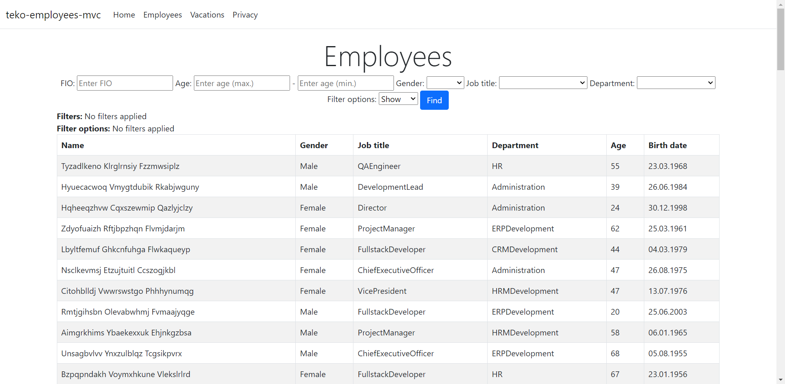
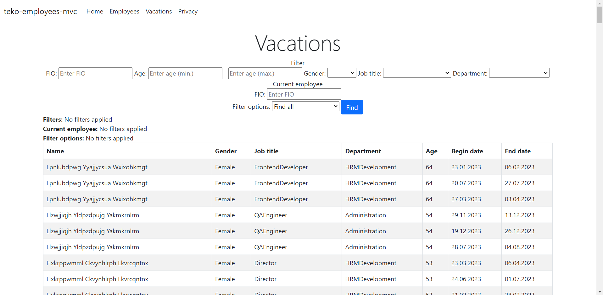

# teko-employees-mvc

Read this in other languages: [English](README.md), [Russian/Русский](README.ru.md).

## Requirements  

1. Generate randomly "employees of the company": 100 user objects (full name, gender, position (listing 10 positions), age).
2. Randomly generate "vacation schedule": 3 "vacation" objects (start date, end date, user object) with a length of 14,7,7 days for each created user in the current year.
3. Request the entry of a "new vacation" for the current employee. The length of the new vacation is not more than 14 days.
4. Display information about vacation crossings according to the criteria:
    - Crossing vacations with employees of my department. Employees under 30 years of age.
    - Vacation crossing with female employees not from my department. Age of employees - over 30, but under 50.
    - Vacation crossing with employees of my department from any department. Employees are over 50 years old.
    - Vacations without crossing.
5. It is desirable to use LINQ, lambda expressions.
6. It is desirable to choose the most efficient algorithm for determining intersections.

## Using the application 

Employees: 

Vacations: 

[Click here](docs/examples.md) to find some examples of how to use the filters. 
