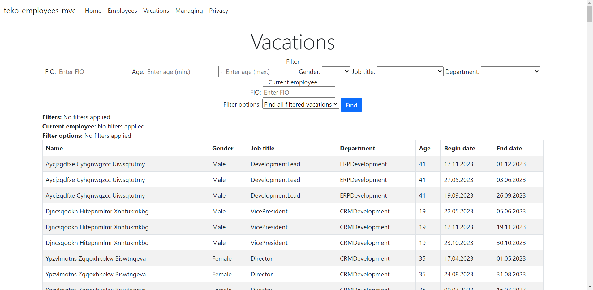

# teko-employees-mvc

Доступно на других языках: [English/Английский](README.md), [Russian/Русский](README.ru.md).

## Требования 

1. Сгенерировать случайным образом "сотрудников компании": 100 объектов пользователь (ФИО, пол, должность (перечисление 10 должностей), возраст). 
2. Сгенерировать случайным образом "график отпусков": 3 объекта "отпуск" (дата начала, дата окончания, объект пользователь) длиной 14,7,7 дней для каждого созданного пользователя в текущем году. 
3. Запросить ввод "нового отпуска" текущего сотрудника. Длина нового отпуска не более 14 дней. 
4. Вывести информацию о пересечениях отпусков по критериям: 
    - Пересечение отпуска с сотрудниками моего отдела. Сотрудники моложе 30 лет. 
    - Пересечение отпуска с сотрудниками-женщинами не из моего отдела. Возраст сотрудников - старше 30, но моложе 50. 
    - Пересечение отпуска с сотрудниками моего отдела из любого отдела. Возраст сотрудников - старше 50 лет. 
    - Отпуска без пересечения. 
5. Желательно использование LINQ, лямбда-выражений.
6. Желательно выбрать максимально производительный алгоритм определения пересечений. 

## Примеры использования  

Сотрудники: 

Отпуска:

Примеры использования фильтров представлены [здесь](docs/examples.md). 
